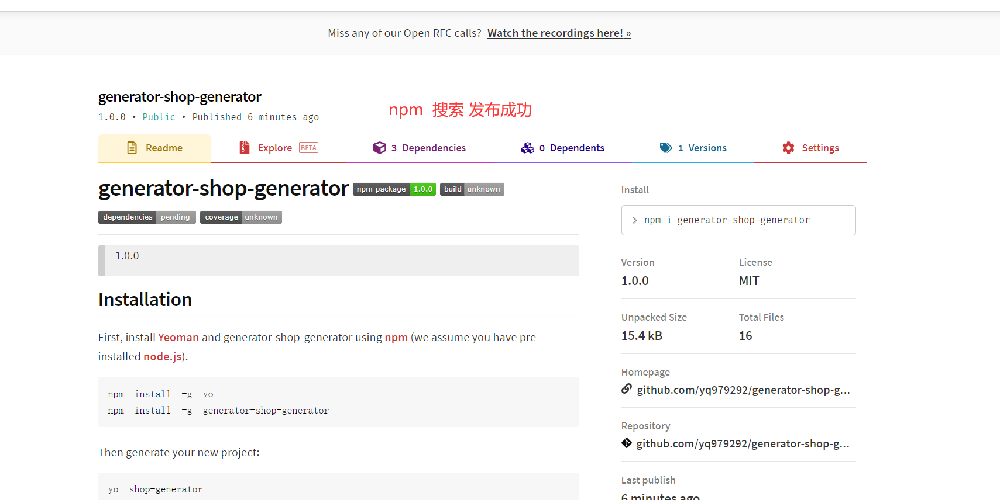

## 制作属于自己的脚手架

**不是cli的脚手架。如果有过兴趣。自己可以使用node.js 中, ？？？？.js 自己写**

**gennerator 的脚手架方式**

### yo命令

官网地址：` https://yeoman.io/yo `

**yeoman** 制作脚手架**命令**

##### 安装

`npm install -g yo`

**yo  命令的作用是制作脚手架命令**

`yo --version` 查看版本号

##### 制作脚手架

**generater-generator 可以制作脚手架工具*

` npm install -g generator-generator `

##### **生成脚手架工具**

`yo gennerator-脚手架名称`

##### **制作中配置项目解释**

##### **脚手架创建成功**

##### **将自己的工程代码放入到脚手架中**

***1更改pack.json文件中version***

***2更改入口文件index.js中部分配置***

***3:开始导入自己的工程代码***

- 导入完成效果

##### 本地测试脚手架是否

`cd generator-shop-generator`

`npm link`

- 随便新建一个文件目录（模拟使用脚手架生项目工程）

- 查看脚手架运行过程结果

##### 发布脚手架

如果不会请自行百度

***将 generator-shop-generator文件发布到npm上***

`npm login`  使用命令登陆到npm

***开始发布***

`npm publish`

##### 测试发布，并从npm 上使脚手架

- 去npm官网搜索 **generator-shop-generator**

- 在本地安装自己的脚手架  

`npm i generator-shop-generator`

- 使用脚手架生成项目

`yo shop-generator`

